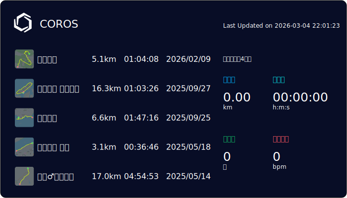

<p align="center">
  <a href="https://github.com/devxb/gitanimals">

</a>
  <a href="https://github.com/summerscar">
<!--      -->
    <p align="center">
      
    </p>
  </a>
</p>
<!--
<p align="center">
<a href="https://github.com/summerscar">
  
</a>
</p> -->

<!--
<p>
 <a href="https://github.com/summerscar">
    
  </a>
<p/>
-->

<!--START_SECTION:waka-->
📊 **This Week I Spent My Time On** 

```text
🕑︎ Time Zone: Asia/Shanghai

💬 Programming Languages: 
No Activity Tracked This Week

🔥 Editors: 
No Activity Tracked This Week

💻 Operating System: 
No Activity Tracked This Week
```

**I Mostly Code in JavaScript** 

```text
JavaScript               49 repos            ███████████████░░░░░░░░░░   58.33 % 
TypeScript               12 repos            ████░░░░░░░░░░░░░░░░░░░░░   14.29 % 
HTML                     8 repos             ██░░░░░░░░░░░░░░░░░░░░░░░   09.52 % 
Java                     2 repos             █░░░░░░░░░░░░░░░░░░░░░░░░   02.38 % 
Rust                     1 repo              ░░░░░░░░░░░░░░░░░░░░░░░░░   01.19 % 
```


 Last Updated on 09/08/2025 15:32:47 UTC
<!--END_SECTION:waka-->

<div>
<br/>
<!-- <a href="https://github.com/summerscar">
  
  <a href="https://github.com/summerscar">
  

</a> -->
</div>
