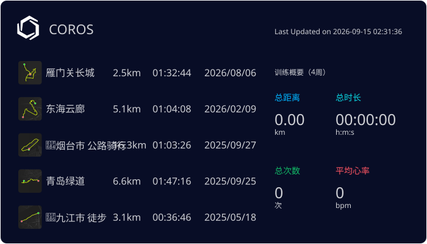

<p align="center">
  <a href="https://github.com/devxb/gitanimals">

</a>
  <a href="https://github.com/summerscar">
<!--      -->
    <p align="center">
      
    </p>
  </a>
</p>
<!--
<p align="center">
<a href="https://github.com/summerscar">
  
</a>
</p> -->

<!--
<p>
 <a href="https://github.com/summerscar">
    
  </a>
<p/>
-->

<!--START_SECTION:waka-->


📊 **This Week I Spent My Time On** 

```text
🕑︎ Time Zone: Asia/Shanghai

💬 Programming Languages: 
TypeScript               11 hrs 25 mins      █████████████████░░░░░░░░   68.77 % 
Markdown                 3 hrs 7 mins        █████░░░░░░░░░░░░░░░░░░░░   18.79 % 
JavaScript               1 hr 17 mins        ██░░░░░░░░░░░░░░░░░░░░░░░   07.81 % 
JSON                     27 mins             █░░░░░░░░░░░░░░░░░░░░░░░░   02.79 % 
Docker                   9 mins              ░░░░░░░░░░░░░░░░░░░░░░░░░   00.93 % 

🔥 Editors: 
VS Code                  16 hrs 37 mins      █████████████████████████   100.00 % 

💻 Operating System: 
Mac                      16 hrs 37 mins      █████████████████████████   100.00 % 
```

🤖 **AI Coding This Week** 

```text
⏱ AI Coding Time: 14 hrs (84.33%)

✍️ 6,538 lines written by AI, 145 lines written by hand (97.83% AI-written)

🔤 13,293,132 Input Tokens, 383,007 Output Tokens

💵 $98.21 Estimated AI Cost This Week

🧠 75 AI Sessions, 263 AI Prompts

Hy                       3,645 lines         █████████████░░░░░░░░░░░░   52.98 % 
Deepseek                 3,235 lines         ████████████░░░░░░░░░░░░░   47.02 % 
Opencode-Cli             0 lines             ░░░░░░░░░░░░░░░░░░░░░░░░░   00.00 % 
Agnes                    0 lines             ░░░░░░░░░░░░░░░░░░░░░░░░░   00.00 % 

🔎 AI Coding Insights:
🤖 AI-Driven — 97.83% of written lines came from AI
📚 Verbose Prompter — average 1,769 characters per prompt
🔁 Iterative Prompter — average 4 prompts per session
🚀 High AI Trust — 3.96% of changed lines were hand-edited
```

**I Mostly Code in JavaScript** 

```text
JavaScript               48 repos            █████████████░░░░░░░░░░░░   52.75 % 
TypeScript               18 repos            █████░░░░░░░░░░░░░░░░░░░░   19.78 % 
HTML                     9 repos             ██░░░░░░░░░░░░░░░░░░░░░░░   09.89 % 
Python                   2 repos             █░░░░░░░░░░░░░░░░░░░░░░░░   02.20 % 
Java                     2 repos             █░░░░░░░░░░░░░░░░░░░░░░░░   02.20 % 
```


 Last Updated on 09/08/2026 15:47:26 UTC
<!--END_SECTION:waka-->

<div>
<br/>
<!-- <a href="https://github.com/summerscar">
  
  <a href="https://github.com/summerscar">
  

</a> -->
</div>
