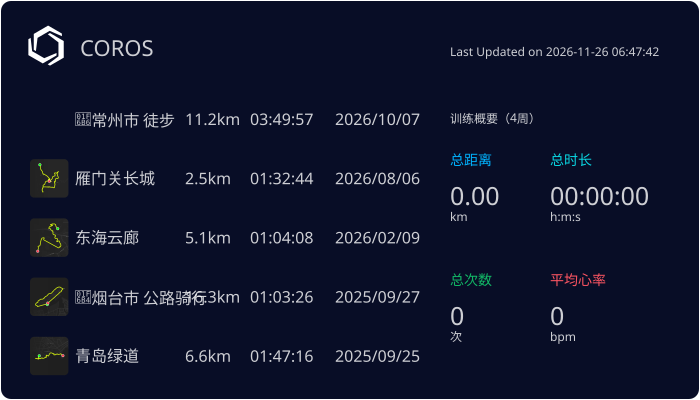
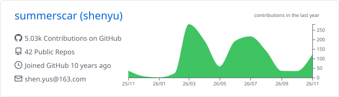
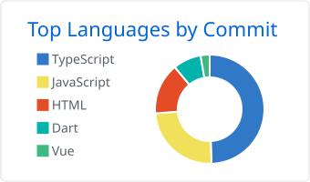
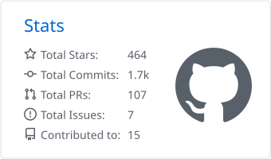

<p align="center">
  <a href="https://github.com/devxb/gitanimals">

</a>
  <a href="https://github.com/summerscar">
<!--      -->
    <p align="center">
      
    </p>
  </a>
</p>
<!--
<p align="center">
<a href="https://github.com/summerscar">
  
</a>
</p> -->

<!--
<p>
 <a href="https://github.com/summerscar">
    
  </a>
<p/>
-->

<!--START_SECTION:waka-->


📊 **This Week I Spent My Time On** 

```text
🕑︎ Time Zone: Asia/Shanghai

💬 Programming Languages: 
Other                    58 hrs 15 mins      █████████████████████████   100.00 % 

🔥 Editors: 
Unknown Editor           58 hrs 15 mins      █████████████████████████   100.00 % 

💻 Operating System: 
Linux                    56 hrs 9 mins       ████████████████████████░   96.39 % 
Mac                      2 hrs 6 mins        █░░░░░░░░░░░░░░░░░░░░░░░░   03.61 % 
```

🤖 **AI Coding This Week** 

```text
⏱ AI Coding Time: 34 hrs 19 mins (58.92%)

✍️ 0 lines written by AI, 0 lines written by hand (0% AI-written)

🔤 1,244,653,851 Input Tokens, 9,156,154 Output Tokens

💵 $9133.69 Estimated AI Cost This Week

🧠 6 AI Sessions, 750 AI Prompts

Dsh-Wakatime-Plugin      0 lines             ░░░░░░░░░░░░░░░░░░░░░░░░░   00.00 % 

🔎 AI Coding Insights:
🧑‍💻 Mostly Hands-On — 0% of written lines came from AI
📚 Verbose Prompter — average 8,127 characters per prompt
🔁 Iterative Prompter — average 125 prompts per session
🚀 High AI Trust — 0% of changed lines were hand-edited
```

**I Mostly Code in JavaScript** 

```text
JavaScript               51 repos            █████████████░░░░░░░░░░░░   52.58 % 
TypeScript               20 repos            █████░░░░░░░░░░░░░░░░░░░░   20.62 % 
HTML                     9 repos             ██░░░░░░░░░░░░░░░░░░░░░░░   09.28 % 
Python                   3 repos             █░░░░░░░░░░░░░░░░░░░░░░░░   03.09 % 
Java                     2 repos             █░░░░░░░░░░░░░░░░░░░░░░░░   02.06 % 
```


 Last Updated on 20/11/2026 22:14:48 UTC
<!--END_SECTION:waka-->

<div>
<br/>
<!-- <a href="https://github.com/summerscar">
  
  <a href="https://github.com/summerscar">
  

</a> -->
</div>
