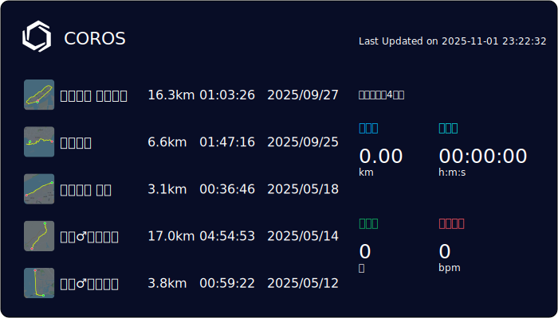

<p align="center">
  <a href="https://github.com/summerscar">
<!--      -->
    <p align="center">
      
    </p>
  </a>
</p>
<!--
<p align="center">
<a href="https://github.com/summerscar">
  
</a>
</p> -->

<!--
<p>
 <a href="https://github.com/summerscar">
    
  </a>
<p/>
-->

<!--START_SECTION:waka-->
**🐱 My GitHub Data** 

> 📦 787.5 kB Used in GitHub's Storage 
 > 
> 🏆 223 Contributions in the Year 2024
 > 
> 💼 Opted to Hire
 > 
> 📜 57 Public Repositories 
 > 
> 🔑 28 Private Repositories 
 > 
**I'm an Early 🐤** 

```text
🌞 Morning                1952 commits        ████░░░░░░░░░░░░░░░░░░░░░   17.12 % 
🌆 Daytime                5929 commits        █████████████░░░░░░░░░░░░   51.99 % 
🌃 Evening                3235 commits        ███████░░░░░░░░░░░░░░░░░░   28.36 % 
🌙 Night                  289 commits         █░░░░░░░░░░░░░░░░░░░░░░░░   02.53 % 
```
📅 **I'm Most Productive on Wednesday** 

```text
Monday                   2359 commits        █████░░░░░░░░░░░░░░░░░░░░   20.68 % 
Tuesday                  1735 commits        ████░░░░░░░░░░░░░░░░░░░░░   15.21 % 
Wednesday                2608 commits        ██████░░░░░░░░░░░░░░░░░░░   22.87 % 
Thursday                 1931 commits        ████░░░░░░░░░░░░░░░░░░░░░   16.93 % 
Friday                   1539 commits        ███░░░░░░░░░░░░░░░░░░░░░░   13.49 % 
Saturday                 518 commits         █░░░░░░░░░░░░░░░░░░░░░░░░   04.54 % 
Sunday                   715 commits         ██░░░░░░░░░░░░░░░░░░░░░░░   06.27 % 
```


📊 **This Week I Spent My Time On** 

```text
🕑︎ Time Zone: Asia/Shanghai

💬 Programming Languages: 
Markdown                 7 hrs 25 mins       █████████████░░░░░░░░░░░░   52.60 % 
TypeScript               5 hrs 22 mins       ██████████░░░░░░░░░░░░░░░   38.14 % 
JSON                     31 mins             █░░░░░░░░░░░░░░░░░░░░░░░░   03.73 % 
CSS                      29 mins             █░░░░░░░░░░░░░░░░░░░░░░░░   03.50 % 
MDX                      16 mins             ░░░░░░░░░░░░░░░░░░░░░░░░░   01.96 % 

🔥 Editors: 
VS Code                  14 hrs 6 mins       █████████████████████████   100.00 % 

💻 Operating System: 
Mac                      14 hrs 6 mins       █████████████████████████   100.00 % 
```

**I Mostly Code in JavaScript** 

```text
JavaScript               47 repos            ███████████████░░░░░░░░░░   59.49 % 
TypeScript               10 repos            ███░░░░░░░░░░░░░░░░░░░░░░   12.66 % 
Java                     2 repos             █░░░░░░░░░░░░░░░░░░░░░░░░   02.53 % 
Rust                     1 repo              ░░░░░░░░░░░░░░░░░░░░░░░░░   01.27 % 
Dockerfile               1 repo              ░░░░░░░░░░░░░░░░░░░░░░░░░   01.27 % 
```


 Last Updated on 18/10/2024 15:34:54 UTC
<!--END_SECTION:waka-->

<div>
<br/>
<!-- <a href="https://github.com/summerscar">
  
  <a href="https://github.com/summerscar">
  

</a> -->
</div>
